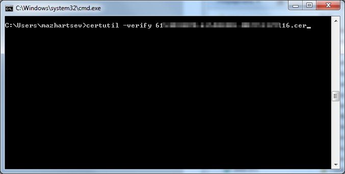
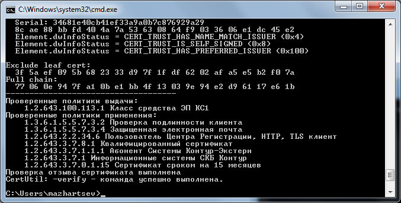
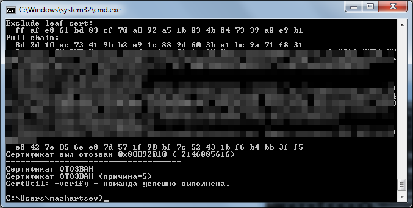

.. _certutil:

Средство командной строки Certutil.exe
=============================================

Средство командной строки ``Certutil.exe`` используется для отображения информации о цифровых сертификатах, установленных в клиенте DirectAccess, на сервере DirectAccess или ресурсе интрасети.

Утилита ``Certutil`` обладает большим количеством функций, многие из которых описаны в статье `Шпаргалка по certutil <http://reply-to-all.blogspot.ru/2014/11/certutil.html>`_.

Просмотр сведений о сертификате
-------------------------------------

Для просмотра сведений о сертификате достаточно выполнить::

    certutil сертификат.cer

Так как сведения сертификата содержат много информации, для удобства лучше перенаправить вывод файл::

    certutil Desktop\my-cert.cer > cert-info.txt
    
В примере рассматривается случай когда сертификат находится на рабочем столе. Весь вывод будет записан в файл ``cert-info.txt``.

Подробнее о работе с командной строкой и перенаправлении вывода смотрите в разделе :ref:`cmd` данного руководства.

Проверка отзыва сертификата
----------------------------------------------

Чтобы проверить открытый сертификат на отозванность, необходимо:

1. Открыть командную строку *«Пуск → Выполнить → cmd»*;
2. Ввести команду ``certutil -verify`` и указать путь до сертификата, например, ``certutil -verify 6654074390-632701001-613402108217.cer``;

Будет показана информация о сертификате. В случае, если сертификат действующий, то будет выведено сообщение:

 ::

    Проверка отзыва сертификата выполнена
    CertUtil: -verify - команда успешно выполнена.

В случае, если сертификат отозван, то будет выведено сообщение ``Сертификат ОТОЗВАН (причина=5)`` и код причины отзыва.

Например, код причины 5 означает, что сертификат отозван по окончанию срока действия.

.. _certutil-verify-code:

.. csv-table:: Таблица кодов причин отзыва сертификатов
   :header: Код причины, Описание
   :widths: 40, 60

    0,Причина не определена
    1,Компрометация ключа
    2,Компрометация ЦС
    3,Изменение принадлежности
    4,Сертификат заменен
    5,Прекращение действия

Просмотр сертификатов пользователя
-------------------------------------

Посмотреть мои сертификаты::
::
    certutil -store -user my 

Экспорт/Импорт в PFX (PKCS#12)
-------------------------------

Экспорт::

    certutil -p test -user -exportPFX 0123456788e8cb1a18e cert.pfx

В качестве параметров указывается серийный номер и пароль (через ``-p``). Посмотреть серийный номер можно вызвав команду ``certutil -store -user my``.

.. warning:: Данная команда работает не совсем корректно, экспорт происходит без открытого ключа.

Импорт::

    certutil -p test -user -importpfx cert.pfx

Работа с криптопровайдером (CSP - Crypto service provider)
----------------------------------------------------------

Информация о текущем криптопровайдере::

    Certutil /scinfo

Списоке всех криптопровайдеров, установленных в системе::

    Certutil -csplist

Информация конкретном CSP::

    Certutil -csptest "cspname" 

Например::

    Certutil -csptest "Microsoft Strong Cryptographic Provider"

Дополнительные ссылки
----------------------------------------------

* `Средство командной строки Certutil.exe <https://technet.microsoft.com/ru-ru/library/ee624045%28v=ws.10%29.aspx>`_
* `Отзыв выданных сертификатов <https://msdn.microsoft.com/ru-ru/library/cc739815%28v=ws.10%29.aspx>`_
* `Проверка инфраструктуры открытого ключа и конфигурации прокси-сервера <https://technet.microsoft.com/ru-ru/library/bb430766%28v=exchg.141%29.aspx>`_
* `Шпаргалка по certutil <http://reply-to-all.blogspot.ru/2014/11/certutil.html>`_