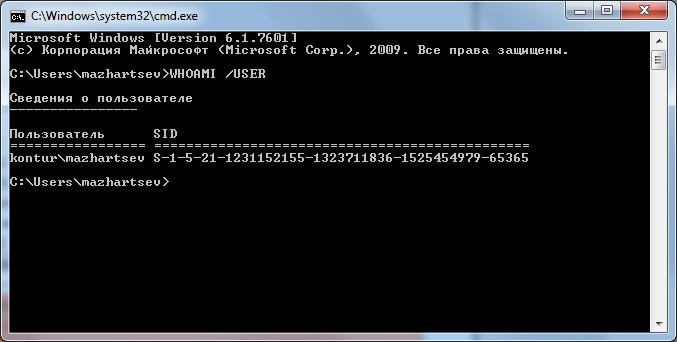

.. _cmd:

Работа с командной строкой
=============================================

Командная строка позволяет вводить и выполнять команды операционной системы и другие компьютерные команды. Вводя команды, можно выполнять на компьютере различные задачи, не пользуясь мышью или сенсорным вводом. 

В разделе перечислены базовые приемы работы в командной строке Windows.

Запуск командной строки
-----------------------------

Для запуска командной строки воспользуйтесь одним из следующих способов:

* «*Пуск → Выполнить*» (или клавиши ``Win+R``) введите ``cmd`` и нажмите клавишу ``Enter``;
* «*Пуск → Все программы → Стандартные → Командная строка*»;
* «*Пуск → Поиск → Командная строка*».

Ввод команд
---------------------------------

Команды вводятся посредством ввода с клавиатуры. Простейшая команда ``help`` выводит список всех доступных команд. Также вы можете просмотреть полный перечень команд в статье `Список команд Windows ( Windows CMD ) <http://ab57.ru/cmdlist.html>`_.

Для вывода справки по конкретной команде введите ``help название_команды``, например:

::

    help whoami

Основные команды
~~~~~~~~~~~~~~~~~~~~~~~~~~~~~~

``ECHO`` -- вывод текста на экран консоли::

    ECHO Имя текущего пользователя %USERNAME%

``CD`` -- смена каталога (Change Directory)::

    cd "C:\Program Files\Crypto Pro\CSP"

``DIR`` -- отображение списка файлов и каталогов;

``RMDIR`` -- удаление каталога;

``DEL`` -- удаление одного или нескольких файлов;

``COPY`` -- копирование файлов и каталогов;

``MD`` -- создание нового каталога;

``MOVE`` -- перемещение файлов и каталогов;

``PING`` -- утилита проверки доступности узла;

``WHOAMI`` -- вывод имени и SID текущего пользователя::

    WHOAMI /USER

Это малая часть доступных команд, для просмотра других команд используйте команду ``help`` или смотрите статью `Список команд Windows ( Windows CMD ) <http://ab57.ru/cmdlist.html>`_.

Bat-файлы
~~~~~~~~~~~~~~~~~~~~~~~~~~~~~~

Используя команды можно написать bat файлы,которые позволяют упрощать и автоматизировать выполнение задач. Более подробно работа с bat файлами рассматривается в статьях:

* `Как создать BAT файл <http://yroki-kompa.ru/kak-sozdat-bat-fajl-ili-virus-v-bloknote.html>`_
* `Писать bat-файлы может каждый! <http://www.philosoft.ru/batniki.zhtml>`_

Автодополнение путей файлов
-----------------------------------

Чтобы не набирать вручную весь путь к файлам используется клавиша ``Tab`` на клавиатуре. Она автодополняет названия директорий и файлов, например, чтобы ввести название папки ``User``, достаточно ввести первую букву и нажать клавишу ``Tab``, будет подставлено соответствующее значение.

Если на букву ``U`` начинается несколько директорий или файлов, то при каждом последующем нажатии ``Tab`` будет происходить перебор названий. Чтобы произвести перебор в обратном порядке, нажимайте ``Tab`` c зайжатой клавишей ``Shift``.

Если папка состоит из нескольких слов, разделенных пробелом или из кириллических символов, то весь путь берется в кавычки, например, ``cd "C:\Documents and Settings"``

Копирование текста в/из командной строки
--------------------------------------------------

По умолчанию копирование текста из командной строки отключено. Чтобы его включить необходимо:

1. Нажать правой кнопкой мыши на заголовок окна командной строки и выбрать пункт «*Свойства*»;
2. Установить галочки напротив «*Выделение мышью*» и «*Быстрая вставка*»;

Для копирования текста из командной строки достаточно выделить текст и щелкнуть правой кнопкой мыши, выделенный текст скопируется в буфер обмена. Для вставки текста в командную строку также используется нажатие правой кнопкой мыши.

.. _FileOut:

Вывод информации в текстовый файл и перенаправление команд
--------------------------------------------------------------

Информацию, выводимую программами в командную строку, можно перенаправить в файл. Делается это с помощью символа ``>``, например, ``systeminfo > C:\Users\mazhartsev\Desktop\test.txt``.

Если файл не существует, то он будет создан. Если существует, то он будет перезаписан. Чтобы записать данные в конец файла, необходимо воспользоваться командой ``>>``, например: ``systeminfo >> C:\Users\mazhartsev\Desktop\test.txt``

Данные команды называются операторами перенаправления.

.. csv-table:: Операторы перенаправления
   :header: Описание, Оператор перенаправления
   :widths: 20, 80

   ``>``, "Записывает данные на выходе команды вместо командной строки в файл или на устройство, например, на принтер."
   ``<``, "Читает поток входных данных команды из файла, а не с клавиатуры."
   ``>>``, "Добавляет выходные данные команды в конец файла, не удаляя при этом существующей информации из файла."
   ``>&``, "Считывает данные на выходе одного дескриптора как входные данные для другого дескриптора."
   ``<&``, "Считывает входные данные одного дескриптора как выходные данные другого дескриптора."
   ``|``, "Считывает выходные данные одной команды и записывает их на вход другой команды. Эта процедура известна под названием «канал»."

Дополнительные ссылки
-------------------------

#. `Командная строка: вопросы и ответы <http://windows.microsoft.com/ru-ru/windows/command-prompt-faq#1TC=windows-7>`_
#. `Список команд Windows ( Windows CMD ) <http://ab57.ru/cmdlist.html>`_
#. `Команды cmd <http://cmd-command.ru/komandy-cmd>`_
#. `Как создать BAT файл <http://yroki-kompa.ru/kak-sozdat-bat-fajl-ili-virus-v-bloknote.html>`_
#. `Использование операторов перенаправления команд <http://www.windowsfaq.ru/content/view/260/57/>`_
#. `Тонкости работы в командной строке Windows <http://habrahabr.ru/post/218759/>`_
