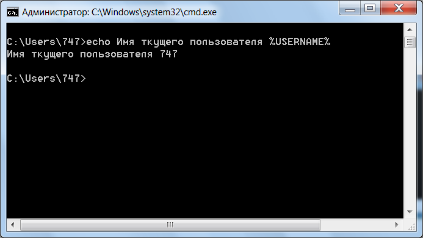
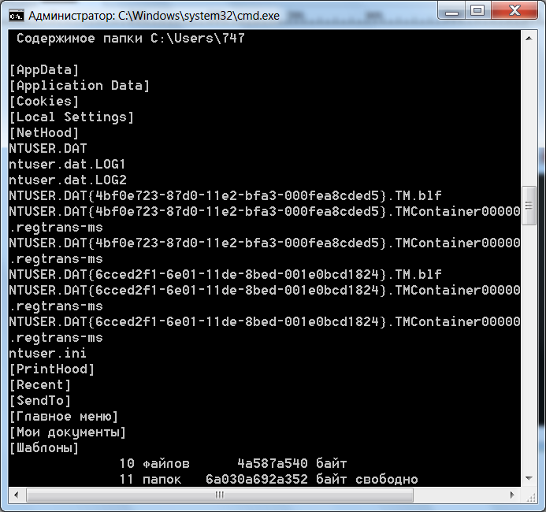

 
.. _commands:

Основные команды
=======================

Большинство команд содержит дополнительные параметры, список которых вы можете посмотреть введя команду ``help имя_команды`` или ``имя_команды /?``, например::

    help move
    move /?

``ECHO`` -- вывод текста на экран консоли::

    ECHO Имя текущего пользователя %USERNAME%

В данном случае ``%USERNAME%`` является переменной, хранящей информацию об имени текущего пользователя. Подробнее переменные среды рассматриваются в разделе :ref:`environment-variable` данного руководства.

``CLS`` -- очищает экран командной строки, вводится без параметров;

``CMD`` -- запуск новой копии интерпретатора командной строки;

``CD`` -- смена каталога (*англ.* Change Directory)::

    cd "C:\Program Files\Crypto Pro\CSP"

Обычно путь берется в кавычки, если в названиях директорий встречаются пробелы или кириллические символы.

``DIR`` -- отображение списка файлов и каталогов::

    dir /a:h /w
    

Команда из примера введена с параметрами ``/a:h`` (показывать все файлы и папки, в том числе скрытые) и ``/w`` (вывод списка в несколько столбцов). Для получения подробной информации по параметрам команды введите ``DIR /?`` (отобразить справку по использованию команды).

``RMDIR`` -- удаление каталога;

``DEL`` -- удаление одного или нескольких файлов;

``COPY`` -- копирование файлов и каталогов;

``MD`` -- создание нового каталога;

``MOVE`` -- перемещение файлов и каталогов;

``FIND`` -- поиск строки символов в файле;

``FINDSTR`` -- поиск строк в файлах с использованием регулярных выражений;

``PING`` -- утилита проверки доступности узла;

``WHOAMI`` -- вывод имени и SID текущего пользователя::

    WHOAMI /USER

.. figure:: img/whoami-user.jpg
       :width: 400 px
       :align: center
       :alt: Результат выполнения команды WHOAMI /USER

``TELNET`` -- telnet-клиент Windows;

``DATE`` -- отображение или изменение даты;

``FC`` -- сравнение содержимого файлов;

``FOR`` -- организация циклической обработки результатов выполнения других команд, списков, и строк в текстовых файлах;

``IF`` -- оператор условного выполнения команд в пакетном файле.

Это малая часть доступных команд, для просмотра других команд используйте команду ``help`` или смотрите статью `Список команд Windows ( Windows CMD ) <http://ab57.ru/cmdlist.html>`_.

Дополнительные ссылки
-------------------------

#. `Список команд Windows ( Windows CMD ) <http://ab57.ru/cmdlist.html>`_
#. `Команды cmd <http://cmd-command.ru/komandy-cmd>`_